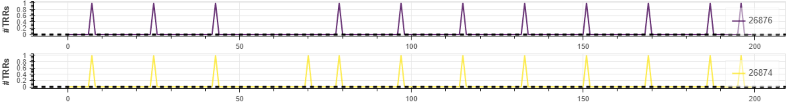
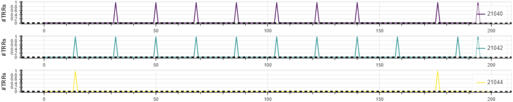

<p align="center">
    <b><h2 align="center">Uncovering In-DRAM RowHammer Protection Mechanisms: A New Methodology, Custom RowHammer Patterns, and Implications</h2></b>
</p>

To protect against RowHammer, vendors commit to security-through-obscurity: modern DRAM chips rely on undocumented, proprietary, on-die mitigations, commonly known as **Target Row Refresh (TRR)**. Security guarantees of TRR mechanisms
cannot be easily studied due to their proprietary nature.

**U-TRR** is an experimental methodology for analyzing in-DRAM TRR mechanisms and assessing their security guarantees. We explain U-TRR and our results based on the analysis of 45 DDR4 DRAM modules from the three major DRAM vendors in our MICRO'21 paper:

> Hasan Hassan, Yahya Can Tugrul, Jeremie S. Kim, Victor van der Veen, Kaveh Razavi, and Onur Mutlu,
"[Uncovering In-DRAM RowHammer Protection Mechanisms: A New Methodology, Custom RowHammer Patterns, and Implications](https://people.inf.ethz.ch/omutlu/pub/U-TRR-uncovering-RowHammer-protection-mechanisms_micro21.pdf)", MICRO'21.

Please cite the paper above in your work that uses U-TRR.

This repository provides the source code of the tools that are part of the U-TRR methodology.

# Getting Started

We implemented U-TRR using the open-source FPGA-based DRAM characterization infrastructure: [DRAM Bender](https://github.com/CMU-SAFARI/DRAM-Bender) a.k.a. SoftMC v2. To run U-TRR experiments, you need an FPGA setup with DRAM Bender installed.

Please check out the prerequisites and installation instructions on the [DRAM Bender](https://github.com/CMU-SAFARI/DRAM-Bender) repository.

After installing DRAM Bender, set an environment variable `DRAM_BENDER_ROOT` that points to the directory that DRAM Bender is installed.

    $ export DRAM_BENDER_ROOT=<PATH_TO_DRAM_BENDER_ROOT_DIRECTORY> 

Now, you can compile and run the U-TRR tools (_RowScout_, _TRR Analyzer_, and _RowHammer Attacker_) as explained below.


# RowScout

RowScout is a tool for 1) finding a set of DRAM rows that meet certain requirements as needed by a TRR Analyzer experiment and 2) identifying the data retention times of these rows.

## Building RowScout
To build the source code of RowScout, go to the RowScout directory and run `make`. E.g.,:

    $ cd ./RowScout
    $ make -j

## Running RowScout
To run RowScout with the default configuration parameters:

    $ ./RowScout

By default, RowScout searches for one row group with two rows that are one row apart, i.e., R-R row layout.

Run `RowScout` with `--help` to see all configuration parameters and their descriptions.

## Output of RowScout
When RowScout successfully finds the desired number of row groups that meet specified requirements, it writes the information about the found row groups in JSON format to the output file. This file is used by TRR Analyzer as an input.

Here is a sample RowScout output:

```json
    {
        "row_group" : [
            {
                "row_id" : 6269,
                "bitflip_locs" : [
                    27507
                ]
            },
            {
                "row_id" : 6271,
                "bitflip_locs" : [
                    40949
                ]
            }
        ],
        "bank_id" : 1,
        "ret_ms" : 512,
        "data_pattern_type" : 0
    }
```

For each `row_group`, the output file contains the row addresses (`row_id`) of the rows in the group, exact bit flips locations within the rows (`bitflip_locs`), the bank address (`bank_id`), the retention time (in milliseconds) of the row group (`ret_ms`), and the data pattern used while profiling (`data_pattern_type`).


# TRR Analyzer
TRR Analyzer is a tool for determining when a TRR mechanism refreshes a victim
row, and using this information to understand how the TRR mechanism operates.

## Building TRR Analyzer
To build the source code of TRR Analyzer, go to the TRR Analyzer directory and run `make`. E.g.,:

    $ cd ./TRRAnalyzer
    $ make -j

## Running TRR Analyzer
TRR Analyzer offers many parameters that the user must set depending on the experiment desired to perform. We explain how to use TRR Analyzer with several examples. Please refer to our paper for more details on the experiments we performed as part of our research.

Run `TRRAnalyzer` with `--help` to see all configuration parameters and their descriptions.

### Finding Out When TRR-Induced Refreshes Happen

To find out which refresh (REF) commands can perform TRR-induced refresh, we perform 200 iterations of a single round where TRR Analyzer performs a large number of hammers followed by a single REF. The user must set `--hammers_per_round` to a sufficiently large value to make TRR always detect the aggressor row and refresh its neighbors during the next TRR-capable REF. However, setting `--hammers_per_round` too large may cause RowHammer bit flips on the victim rows before refresh happens. Thus, `--hammers_per_round` should be set below the minimum hammer count that causes bit flips in the victim rows. In the next section, we explain how the user can set `--hammers_per_round` appropriately.

    $ ./TRRAnalyzer --row_scout_file ../RowScout/sample.R-R --row_layout RAR --num_rounds 1 --num_iterations 200 --hammers_per_round 5000 --refs_per_round 1

To visualize the results of TRR Analyzer, we provide a Python script (`TRRAnalyzer/scripts/plot_trran.py`) that parses the output of TRR Analyzer and creates a plot that shows potential TRR-induced refreshes happened at each iteration of the experiment. 

To run the plotting script, you need to first install the `bokeh` python package:

    $ pip3 install bokeh

Then, from the `TRRAnalyzer` directory, run:

    $ ./scripts/plot_trran.py ./sample_output/finding_trr-induced_refs_5k-hammers.trran

The script will create the following two line plots (one plot for each victim
row) as an .html file:



The x-axis shows different iteration numbers. The y-axis shows whether the victim row is refreshed by a TRR-induced (or regular) refresh operation (when `y=1`) or not (when `y=0`). From the plot, we observe that both victim rows get refreshed generally by the 18th REF command in a row.

### Analyzing the Aggressor Row Tracking Mechanism

To analyze the effect of hammer count on TRR's aggressor row tracking mechanism, we can perform an experiment where we hammer multiple aggressor rows with different hammer counts. In this example, we use `RARAR` row layout, as in a double-sided RowHammer attack. We hammer the leftmost aggressor 5000 times and the rightmost aggressor 1 time.

    $ ./TRRAnalyzer --row_scout_file ../RowScout/sample.R-R-R --row_layout RARAR --num_rounds 1 --num_iterations 100 --hammers_per_round 5000 1 --refs_per_round 1



THe plot shows that the victims adjacent to the leftmost aggressor row are typically the targets of the TRR-induced refresh operations. This suggests that the TRR mechanism prioritizes refreshing the neighbors of rows with higher activation count.

### Sanity Check for Retention Time Consistency
As a sanity check to make sure retention failures occur as intended when no regular and TRR-induces refresh happens, one can run a TRR Analyzer experiment without performing any hammers or refresh. The following command performs an experiment where no refresh commands are issued, which leads to zero regular and TRR-induces refreshes. Therefore, we expect to observe retention failures on the victim rows on every iteration.

    $ ./TRRAnalyzer --row_scout_file ../RowScout/sample.R-R --row_layout RAR --num_rounds 1 --num_iterations 100 --hammers_per_round 0 --refs_per_round 0


# RowHammerAttacker
RowHammerAttacker is a tool for testing the effectiveness various RowHammer access patterns on causing bit flips. In our research, we used RowHammerAttacker to test the RowHammer access patterns that we crafted based on the understanding developed using TRR Analyzer.

## Building TRR RowHammerAttacker
To build the source code of RowHammerAttacker, go to the RowHammerAttacker directory and run `make`. E.g.,:

    $ cd ./RowHammerAttacker
    $ make -j

## Running RowHammerAttacker

Running RowHammerAttacker with default configuration parameters performs a double-sided RowHammer attack across an entire bank (i.e., bank 1). To test a RowHammer access pattern as in a real system,  RowHammerAttacker issues a REF command once every tREFI (e.g., 7.8 us) to emulate normal operation of memory controllers.

    $ ./RowHammerAttacker

Run `RowHammerAttacker` with `--help` to see all configuration parameters and their descriptions.

A simple double-sided RowHammer attack normally should not cause bit flips on TRR-protected DRAM chips. To successfully circumvent TRR protection as we explain in Section 7 in our paper, we can utilize dummy rows to divert the TRR mechanism to detect a dummy row as an aggressor instead of the actual rows that we aim to hammer. To perform a RowHammer attack that circumvents counter-based TRR with 16 counters (see Section 7.1), RowHammerAttacker can be configured as follows:

    $ ./RowHammerAttacker --row_layout VAVAV --bank 1 --hammers_per_ref_loop 24 24 --num_ref_loops 16384 --num_dummy_rows 16 --dummy_banks 1 --hammer_dummies_after

With the above configuration, we hammer the aggressor rows for the duration of 16384 REF commands, issued with tREFI intervals, which is typically equivalent of 2 refresh periods. We do so to ensure we hammer the aggressor rows for at least one full refresh period during which regular refresh does not target the victim rows. For example, assuming refresh period of 64 ms, the victim rows can be refreshed (by regular refresh) 32 ms after the RowHammer attack starts. In this case, from start to when the victim rows get refreshed, the aggressor rows accumulate only half of the hammer count possible within the refresh period of 64 ms, which may not be sufficient to cause a bit flip on the victim rows. However, the regular refreshes will not target the victim rows for the next 64ms. Thus, RowHammerAttacker can accumulate hammers for 64 ms and have higher chance to cause bit flips on the victim rows.

## Output of RowHammerAttacker

RowHammerAttacker generates an output file similar to:
```
0: 1 4 0 
1: 0 3 0
```

where, in each line, the first number represents the row address of the leftmost row in the row layout (VAVAV in this example), and the following numbers represent the bit flip count observed in each victim row in the row layout. So, in the first line, we see rows at addresses 1 and 3 are the aggressor rows, the attack causes one bit flips in the row at address 0, 4 bit flips in the row at address 2, and no bit flips in the row at address 4.